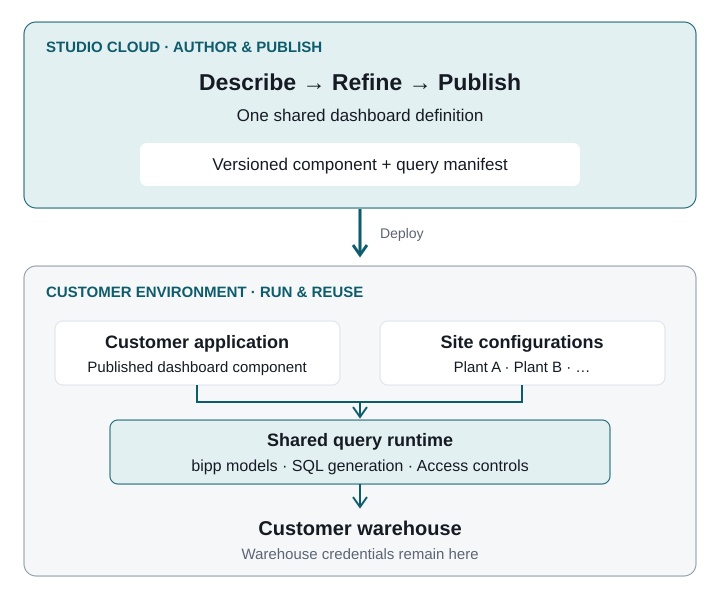

# bipp's Next Chapter: From Prompt to Production Analytics

## The opportunity

bipp already provides semantic modeling, in-database analytics and embedded
dashboards. Nodex Studio proposes a new authoring and publishing experience on
that foundation: describe the analytics you need, refine them visually, and
publish a reusable component into the application where people work.

The opportunity is to shorten the path from a business question to working
analytics. Customers could build on their agreed metrics, reuse dashboards
across sites, and adopt changes through controlled releases. For bipp, this could
expand how existing customers use the platform and give application teams a new
reason to build with it. A pilot would test that opportunity.

## The experience

Consider a manufacturing customer with an operations application used across
several plants. An analyst asks Studio for a dashboard showing output, downtime
and quality against target, using the customer's approved bipp models. They
adjust the layout visually and check the result against a familiar report.

An authorized publisher releases the dashboard as a component. The application
team integrates it into the existing operations screen. A second plant connects
its data through a site configuration using the same dashboard definition;
access remains subject to the user's permissions.

When the team improves the dashboard, it publishes a new version. Application
owners can review compatibility and choose when to adopt it. The intended result
is a repeatable path from an analyst's question to analytics used in daily work.

## What changes for customers

| Customer problem | Proposed improvement |
|---|---|
| Dashboard changes require repeated specialist work. | Prompt and visual editing share one definition, shortening the create–review–refine cycle. |
| Each application integration needs engineering effort. | Reusable components have documented interfaces and versioned releases. |
| Similar dashboards drift across sites. | One shared definition uses separate site data configurations, reducing copies and repeated updates. |
| Analytics updates can disrupt operational applications. | Compatibility checks and controlled upgrades give application teams a predictable release process. |

These are intended improvements to measure. Existing bipp capabilities remain
the starting point: embedding, self-service exploration, maps, alerts and
multi-site reuse already have published precedents. The proposed contribution
is the combined authoring, component publishing and site-binding workflow.

## How it builds on bipp

**Author and publish.** In the proposed cloud control plane, prompts and visual
edits update one structured dashboard definition. A controlled build produces
a frontend component and a description of its data requirements. Stable
interfaces let application teams integrate the result and manage upgrades.

**Run close to the data.** The component queries a shared runtime inside the
customer's environment. That runtime uses bipp's models, SQL generation and
access controls to query the warehouse. Warehouse credentials stay there;
temporary query caching can also remain there. The cloud authoring service
does not proxy warehouse queries or receive their results.

**Reuse across sites.** Site configurations connect the shared definition to
local models and available features. Repeated dashboard elements follow the
data when queries run. Adding a site would not require publishing a separate
dashboard package.

The build is designed to derive interfaces from the dashboard definition; the
AI edits that definition within supported capabilities. Model quality and runtime
limits remain essential to correct, controlled queries. The first integration
review should establish how this maps to bippDash and the existing embedded SDK.

## Prove it with one pilot

Start with one existing customer workflow: one dashboard, one consuming
application and two sites. Use reviewed bipp models and a small set of supported
widgets. Demonstrate a prompt edit, a visual refinement, a published component,
the second site's onboarding and a compatible dashboard update.

Compare the pilot with the current workflow on **time to publish**, **effort to
onboard the second site**, and **work required to adopt an update**. Verify metric
agreement and access restrictions in both sites. Agree targets with the customer
before the pilot; use the results to decide whether to expand.

Three tradeoffs should be explicit. Initial customization is limited to
supported dashboard capabilities. The customer-side runtime needs an operating
and support owner. Reusing existing bipp services depends on the interfaces
available to the integration. Broader widget coverage, additional delivery
formats, alerts and annotations can follow the validated workflow.

## Decisions to make together

1. **Product direction:** should this become an experience within bipp or a
   separate product built on it, and which customer workflow should lead?
2. **Integration:** what can we reuse from bippDash, the SDK, models and security
   services, and what additional interfaces are needed?
3. **Pilot ownership:** who supplies the customer context, integration support
   and runtime operations, and what evidence warrants the next investment?

The proposed next step is a joint walkthrough of one customer workflow and the
integration boundaries, followed by agreement on a pilot and its success measures.

[bipp capabilities and supporting sources](00b-platform.md) ·
[Technical architecture appendix](01-overview.md)
