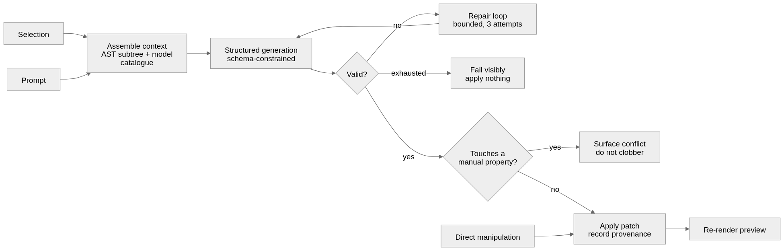

# 03 — Studio

Studio is the authoring surface. It has two input modes — prompts and direct
manipulation — and they are not two systems. They are two ways of producing the
same thing: a validated patch against the dashboard AST (**I6**).

## The editing model

```
prompt ──┐
         ├──▶ patch ──▶ validate ──▶ apply to AST ──▶ re-render preview
manual ──┘
```

There is no separate "generated mode" and "manual mode", no import/eject step,
and no point at which a dashboard stops being editable by one of the two modes.
That property is the whole reason for the closed schema
([ADR-0002](adr/0002-schema-bounded-generation.md)).



## What the model is allowed to produce

**The LLM emits schema-conforming AST patches. Nothing else (I3).**

It does not write component code, CSS, SQL, or public API. It selects node types,
fills properties with legal values, and references model fields that exist. Its
output is checked against the schema mechanically, so "the model produced
something subtly wrong" collapses into "the model produced something invalid",
which is detectable.

The alternative — a model that writes code — buys unbounded expressiveness and
loses bidirectional editing permanently. You cannot render arbitrary generated
code back into a property panel, so the moment a prompt does something novel,
manual refinement of that widget stops working. That is exactly the moment users
most want to refine it. See
[ADR-0002](adr/0002-schema-bounded-generation.md) for the full argument.

## Prompt pipeline

```
user prompt
  └─▶ assemble context
        • current AST (or the selected subtree)
        • selection
        • available models, dimensions, metrics from the modeling layer
        • schema definition for the node types in scope
  └─▶ model call ──▶ candidate patch (structured output, schema-constrained)
  └─▶ validate (structural → referential → semantic)
        ├─ valid   ──▶ apply, record provenance, re-render
        └─ invalid ──▶ repair loop
```

Two details carry most of the reliability:

**Constrain generation at the decoding level, not the prompt level.** The patch
is produced as structured output against the AST schema, so structurally invalid
patches are largely unrepresentable rather than merely discouraged.

**Pass the model catalogue, not the warehouse schema.** The model chooses from
dimensions and metrics that the modeling layer already defines. It never sees
raw tables and never invents a field name. This is the single biggest reason
this design is more reliable than prompt-to-SQL: the space of legal references
is small, enumerated, and known ahead of time.

## Validation and repair

On validation failure, return the specific error to the model and retry, bounded
to a small number of attempts (two or three). Errors are precise and
machine-generated — `unknown metric "gross_margin"; available: [...]`, not "that
didn't work".

If the repair loop is exhausted, **fail visibly and do nothing**. Do not apply a
partial patch. A dashboard that silently half-changed is worse than a dashboard
that refused, because the user's mental model of the document is now wrong.

Failures are logged with the prompt and the validation error. Recurring failures
are the primary signal for what the schema is missing.

## Selection

Prompts need a referent. "Make this bigger", "change this to a line chart", "use
the brand palette here" are all meaningless without one.

- Selection is explicit and visible — the user clicks a widget, or selects
  several.
- With a selection, the prompt is scoped to that subtree and the resulting patch
  may only touch it.
- With no selection, the prompt operates at dashboard level and may add,
  remove, or rearrange widgets, but is still a patch.

Scoping is enforced structurally, not by instruction: a patch whose ops fall
outside the selected subtree is rejected before it is applied. This keeps "change
this chart's colour" from quietly restyling the dashboard.

## Provenance and clobbering

Every property records whether its current value came from a prompt or from a
hand edit ([02-ast.md](02-ast.md#provenance)). A prompt-originated patch does not
overwrite a manually-set property; it skips it, and Studio tells the user which
values it left alone and offers to apply them.

This is what makes "prompt first, fine-tune by hand" actually hold up over a
session, rather than turning into the user re-applying the same three tweaks
after every prompt.

## Division of labour

Direct manipulation is instant, precise, and reversible. Prompting is slower and
probabilistic. Users resent prompting for something they could do in one click,
and they resent clicking forty times for something they could say in a sentence.

The split the UI should encourage:

| Use prompts for | Use direct manipulation for |
|---|---|
| Creating a dashboard from nothing | Resizing and repositioning |
| Adding a widget that needs several decisions at once | Changing one property |
| Bulk change ("apply the brand palette to every chart") | Colour, label, format tweaks |
| Restructuring ("split this into two tabs by region") | Reordering, show/hide |
| Anything requiring knowledge of the data model | Anything the user can see and point at |

Neither mode should be made to cover the other's job, and neither should be a
second-class path to the AST.

## Explore and publish

Not everyone who asks a question should have to be a developer, and not every
answer should become a contract. Studio has two modes, with deliberately
different guarantees.

| | Explore | Publish |
|---|---|---|
| Who | Anyone with access to the models | Authoring developer |
| Produces | A view, shareable by link | A versioned package and a query manifest |
| Public API | None (I10) | Yes, under mechanical semver (I4, I5) |
| Can break someone's build | No | Yes, which is why it is gated |
| Lives | A saved personal or shared view | The customer's package registry |

Both modes edit the same AST through the same validated patch pipeline (I6), so
they are not two products. An exploration that turns out to matter is **promoted**
rather than rebuilt: it gains stable node ids, a version, and a manifest, and
becomes a published dashboard with the same content it already had.

This is what makes the level 5 claim in
[Product update](00a-product-update.md) true without putting the API contract at
risk. A business user can pose a new question, chart it, filter it and share it
without a data team in the loop, because nothing they make carries a version
that someone else's code depends on. The moment something does carry that
contract, publishing it is a developer's decision and passes the semver gate
([Versioning](07-versioning.md)).

The permission boundary is therefore on **publish**, not on authoring. Exploring
is as open as read access to the models allows.

## Preview

The preview in Studio is the real artifact, not an approximation: the same
components, the same rendering path, the same runtime. It differs only in where
it gets data — Studio's preview queries through the control plane's
development connection to the customer's runtime, with the authoring
developer's own identity and row-level security applied.

Because prompts have latency and direct manipulation does not, the preview must
handle both without the interaction model flipping: manual edits apply
optimistically and instantly; prompt edits show a pending state on the affected
subtree only, leaving the rest of the dashboard live and interactive.

## Escape hatch

Some requests will fall outside the schema. The schema should grow to absorb the
common ones — that is what the failure log is for — but there will always be a
tail.

The escape hatch is a **custom widget**: its own query and its own render,
displayed in Studio as an opaque block that the property panel does not attempt
to turn into a form. It is explicitly one-way. Once a widget is custom, it is
not editable by prompt or by panel.

Two properties make this acceptable:

- **It is contained.** One widget loses bidirectional editing. The dashboard
  around it stays fully manipulable. This is the Notion-code-block pattern, and
  it is very different from letting generated code leak into the whole document.
- **It is visible.** The user can see exactly which parts of their dashboard have
  left the managed world, and what that costs them.

**O3 (OPEN)** — whether this ships in v1. The argument for deferring: shipping an
escape hatch early teaches users to reach for it instead of reporting the gap,
and the failure log is far more valuable during the period when the schema is
still being shaped. The argument against: without it, some evaluations will be
lost outright over one widget.
