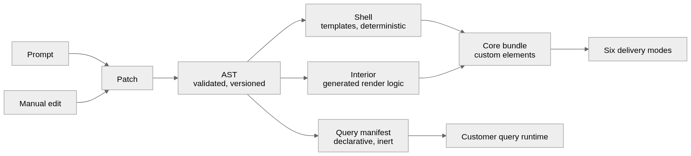

# 04 — Code generation

The build plane turns a validated AST into two artifacts: a frontend bundle and a
query manifest. This document covers the frontend; the manifest is in
[06-data-plane.md](06-data-plane.md).



## The split: shell and interior

Generation is divided in two, and the boundary is the public API.

| | **Shell** | **Interior** |
|---|---|---|
| What | Element tag names, props, events, slots, theme tokens, `.d.ts`, framework wrappers, registration | Rendering logic inside each widget |
| Produced by | Templates, from the AST | Generation, per widget |
| Determinism | Byte-identical for the same AST | Free to differ between builds |
| Visible to consumers | Yes — this *is* the contract | No |

**The model never authors anything in the shell column (I3, I4).**

This is what makes regeneration safe for the consuming developer. Their
hand-written code depends only on the shell, and the shell is a pure function of
the AST (**I4**). A rebuild that changes the interior completely — different
internal structure, different helper functions, different everything — is
invisible to them.

If instead the public surface were whatever the model happened to emit, then a
rename on a Tuesday would be a silent breaking change in a customer's production
build, with no signal to anyone. Making the shell deterministic is also what
makes the semver gate in [07-versioning.md](07-versioning.md#mechanical-semver)
possible at all: you can only compute an API diff mechanically if the API is
mechanically derived.

### What the shell contains

Derived directly from AST node ids and dashboard-level params (**I5**):

```ts
// generated, deterministic
declare global {
  interface HTMLElementTagNameMap {
    'nodex-dashboard-sales': SalesDashboardElement;
  }
}

export interface SalesDashboardElement extends HTMLElement {
  region: string | null;              // from Dashboard.params
  dateRange: [string, string] | null;
  readonly widgets: { w_7f3a91: WidgetHandle; w_c14b02: WidgetHandle };
  addEventListener(t: 'widget-click', l: (e: WidgetClickEvent) => void): void;
  addEventListener(t: 'filter-change', l: (e: FilterChangeEvent) => void): void;
}
```

Every name in that file traces to a stable AST id or a declared param. None of it
is a model's choice.

## Compilation target: custom elements

The artifact compiles to **custom elements with Shadow DOM**. This is the
decision that collapses six distribution modes into one build
([ADR-0003](adr/0003-web-components-target.md)); the packaging consequences are
in [05-distribution.md](05-distribution.md).

Shadow DOM is required, not optional. The web component and npm library modes
put our markup inside an application whose CSS we have never seen and cannot
test against. Without encapsulation, the customer's global styles and ours
corrupt each other in ways that are untraceable from either side.

### Theming contract

Encapsulation means styles cannot be reached from outside, so theming needs a
deliberate, documented surface:

- **CSS custom properties** are the theme API. They pierce the shadow boundary by
  design, so they are the supported way for a consuming application to make the
  dashboard match its own design system.
- **`::part()`** is the escape hatch, on a small, explicitly enumerated set of
  parts. Every exposed part is a compatibility commitment
  ([07-versioning.md](07-versioning.md)) — expose few, deliberately.
- Everything else is internal and may change on any build.

```css
nodex-dashboard-sales {
  --nodex-font-family: Inter, system-ui, sans-serif;
  --nodex-surface: #1b1c22;
  --nodex-text: #e8e8ec;
  --nodex-accent: #6c5ce7;
  --nodex-grid-gap: 12px;
}
```

### Known costs of Shadow DOM

These are real and must be handled in the component layer rather than
rediscovered per dashboard:

- **Overlays** — tooltips, dropdowns, and modals must either render inside the
  shadow root with correct stacking, or use the top layer (`popover`,
  `<dialog>`). Naive absolute positioning escapes to the wrong coordinate space.
- **Measurement** — code that measures against `document` instead of the shadow
  root gets wrong answers. This is the most common source of charting library
  breakage.
- **Focus and accessibility** — focus traversal and `aria-*` references across
  shadow boundaries need explicit handling; `aria-labelledby` does not cross.
- **Fonts** — `@font-face` must be declared in the outer document; it does not
  resolve from inside a shadow root.

**O2 (OPEN)** — chart library selection. The binding constraint is correct
rendering inside a shadow root, which eliminates several otherwise reasonable
candidates. Canvas-based libraries are generally safer here than SVG libraries
that measure via `document`. Whatever is chosen must be validated inside a shadow
root, inside an iframe, and inside a host app with an aggressive global
stylesheet before it is committed to — this choice is extremely expensive to
reverse once artifacts are in the wild.

## Reactive runtime

Widgets need reactive properties, templating, and lifecycle. This is **O1
(OPEN)** — see [ADR-0007](adr/0007-reactive-runtime.md).

The consideration specific to this document: whatever runtime is chosen becomes
the target the interior generator writes against. A library the model already
knows well generates more reliably, with fewer repair loops, than a bespoke API
that must be taught in-context on every call. That argues for Lit unless the
bespoke layer is narrow enough to be a genuine DSL — in which case it should be
validated and auto-repaired like the AST is, not merely prompted.

Note that the interior is the *only* place this matters. The shell is templates,
and the AST is framework-agnostic by construction, so this decision is
reversible at higher cost than a config change but far lower than a rewrite.

## Build pipeline

```
AST (validated, versioned)
 │
 ├─▶ shell generator (templates, deterministic)
 │     └─ tags, props, events, slots, theme tokens, .d.ts, wrappers
 │
 ├─▶ interior generator (per widget)
 │     └─ render logic against the reactive runtime
 │
 ├─▶ manifest generator (deterministic) ──▶ query manifest  [06]
 │
 └─▶ bundler
       ├─ core ESM bundle (shared runtime externalised)
       ├─ framework wrapper entry points
       ├─ standalone app shell
       └─ CDN build (immutable, versioned, SRI)
```

Properties the pipeline must hold:

- **Reproducible.** The same AST and the same toolchain version produce the same
  output. Builds are cached by AST hash; an unchanged dashboard is not rebuilt.
- **Fails closed.** A build that cannot produce a valid shell fails. It never
  emits a partial package.
- **Shared runtime is externalised.** Ten dashboards in one host application must
  not ship ten copies of the runtime — see
  [05-distribution.md](05-distribution.md#shared-runtime).
- **No endpoint, no credentials (I7).** Nothing in this pipeline bakes a URL or a
  secret into an artifact.
