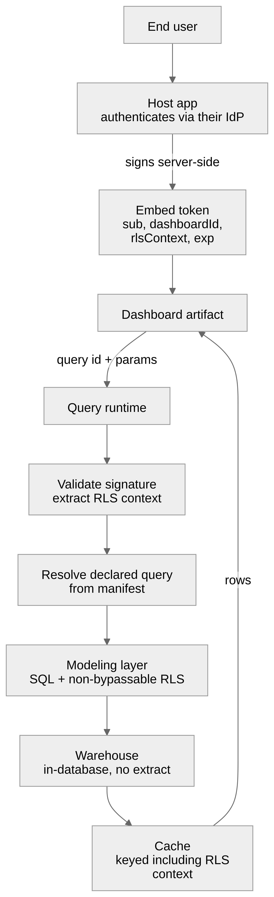

# 06 — Data plane

Everything in this document runs inside the customer's own environment. The
control plane holds no warehouse credentials (**I8**) and never proxies a query.
Nodex may *operate* the runtime on a managed plan, but it runs in the customer's
account either way — see below.

## Where it runs and who operates it

Two independent questions. Conflating them is how a deployment conversation goes
wrong, because one of them is fixed and the other is a choice.

**Where it runs is not a choice.** The runtime sits in the customer's own network
or cloud account, always. This is I8, and it is what lets the product claim it
never holds the customer's data — a claim that would otherwise be
untrue the moment we offered hosting
([Product update](00a-product-update.md)).

**Who operates it is a choice.**

| | Self-operated | Nodex-managed |
|---|---|---|
| Runs in | Customer's network or cloud account | Customer's cloud account |
| Deployed and upgraded by | The customer | Nodex, through a scoped role |
| Credentials held by | The customer's secret store | The customer's secret store |
| Upgrade pace | Customer's schedule | Nodex's, within an agreed window |
| Suits | Airgapped, regulated, or infrastructure-confident customers | Customers who want the capability without running it |

Because the runtime is a single versioned deployable executing inert manifests
(I9, [ADR-0004](adr/0004-manifest-not-service.md)), who operates it is a
deployment decision rather than an architectural one. Nothing about the manifest,
the query protocol, or the artifact changes between these columns.

### What Nodex-managed means concretely

- Nodex holds a **scoped role in the customer's cloud account** — enough to
  deploy, upgrade, monitor and restart the runtime. Not enough to read from the
  warehouse.
- **Warehouse credentials stay in the customer's own secret store.** Nodex
  configures the runtime with a reference to them, never the value, and cannot
  retrieve them through the role it holds.
- **Every action is logged in the customer's own account**, in their audit trail
  rather than one we show them.
- **The role is revocable by the customer at any time**, which stops managed
  operation and leaves the runtime in place, still running.

The operating principle is that Nodex operates the service without reading the
data passing through it. **O8 (OPEN)** is the honest exception: whether an
operator may read query results or result-bearing logs while debugging a
customer's incident. Convenient, occasionally the fastest path to a fix, and the
one hole in the claim above. Decide it deliberately and write it into the
contract rather than discovering it during an incident.

### What it buys beyond convenience

Managed customers stay close to current, which shrinks the version-skew problem
that [Versioning](07-versioning.md) is largely about. The long tail of runtimes
eleven months behind is a property of self-operation, not of the architecture.

## The central decision: manifest, not service

When a dashboard is built, the build plane emits a **declarative query manifest**
— not a deployable backend service (**I9**,
[ADR-0004](adr/0004-manifest-not-service.md)).

The manifest is inert data describing every query the dashboard needs. It is
executed by **one versioned query runtime**, which the customer deploys once and
upgrades on their own schedule, and which serves every dashboard they have.

The alternative — generating a backend service per dashboard — sounds equivalent
in a design meeting and is operationally very different. N customers × M
dashboards produces thousands of distinct services, an unknown number of them
inside customer premises we cannot reach. The day an auth bug is found in the
query path, remediation is a fleet-wide redeploy across infrastructure we do not
own, to a version list we do not have. That is not a patchable system.

With a manifest: the security fix is one runtime release, the customer upgrades
one component, and every dashboard they own is fixed at once. The generated
artifact contains no executable code and no credentials, so it is not a patch
target at all.

## Manifest shape

Indicative:

```yaml
manifestVersion: "1.3"
dashboardId: d_9a21e4
astVersion: 47
minRuntime: "2.1.0"

queries:
  - id: q_kpi_total_sales
    widget: w_7f3a91
    model: retail_sales          # resolved in the modeling layer
    metrics: [total_sales]
    filters: [$city, $state, $department]
    maxAge: 60s                  # see "Freshness and refresh"

  - id: q_sales_trend
    widget: w_c14b02
    model: retail_sales
    dimensions: [{ field: order_date, grain: month }]
    metrics: [total_sales, total_profit]
    filters: [$city, $state, $department]
    orderBy: [{ field: order_date, dir: asc }]

params:
  - { name: city,       type: string[], required: false }
  - { name: state,      type: string[], required: false }
  - { name: department, type: string[], required: false }
```

Note what is absent: no SQL, no table names, no join logic, no connection
details. The manifest references **model entities by name**. Resolving those into
SQL is the modeling layer's job, and it is pre-existing bipp functionality —
models, joins, metric definitions, and row-level security are already declared
there, under the customer's own git version control.

This is the reason this design is materially safer than prompt-to-SQL: the
generated layer never expresses arbitrary SQL, so it cannot express a wrong join,
a fan-out, or an unbounded scan. It can only reference metrics someone already
defined and reviewed.

It also means **business logic never ships to a client.** A dashboard running
inside a customer's own web application, served from a CDN, or imported into an
internal tool contains no join, no metric definition and no table name. The
organization's business logic stays in the modeling layer under its own version
control, and the artifact carries only references into it. That is a stronger
guarantee than keeping queries server-side: there is no query in the client to
begin with, so there is nothing to read out of a bundle.

## Query runtime

One service. One version at a time per customer. Responsibilities:

1. **Serve manifests.** Load the manifests for deployed dashboards.
2. **Authenticate.** Validate the embed token; extract identity and row-level
   filter context ([08-security.md](08-security.md)).
3. **Resolve.** Bind the manifest query plus the request's params and filters to
   the modeling layer.
4. **Delegate SQL generation** to the modeling layer, with row-level security
   applied as a non-bypassable predicate.
5. **Execute** against the warehouse, in-database, no extract.
6. **Enforce limits** — per-tenant and per-user query concurrency, row caps,
   timeouts, cost ceilings.
7. **Cache** by (query, resolved params, RLS context). The RLS context must be
   part of the cache key; omitting it is a cross-user data leak.
8. **Audit.** Log who ran what, when, with which filters.

It also refuses manifests it is too old to execute (`minRuntime`), with an
explicit version error rather than a partial render
([07-versioning.md](07-versioning.md)).



## Query protocol

The wire protocol between artifact and runtime is a long-lived public contract.
A dashboard pinned into a customer's internal application two years ago is still
calling it ([07-versioning.md](07-versioning.md#three-cadences)).

- Explicitly versioned, negotiated at handshake.
- Additive changes only within a major version.
- The runtime advertises its capabilities; the client degrades predictably
  against an older runtime rather than failing opaquely.
- Requests carry: query id, params, filter values, embed token, protocol version.
- Requests never carry: SQL, model definitions, credentials, or anything the
  client could forge to widen its own access.

The last point is the important one. A client can only ask for queries the
manifest already declares, with parameter values the runtime validates. It cannot
construct a new query. Compromising the frontend does not widen data access
beyond what that dashboard was already permitted.

## Freshness and refresh

In-database execution means a query returns current data. It does not, on its
own, mean a dashboard stays current — a page that loaded an hour ago shows
hour-old numbers unless something refreshes it. For a dashboard people use to
monitor anything, silent staleness is the failure that matters, because a stale
number looks exactly like a fresh one.

Three mechanisms, and they are separate on purpose:

**Declared freshness.** Each query in the manifest carries a `maxAge`. It is the
cache's authority: a request arriving after `maxAge` bypasses the cached result
rather than serving it. Freshness is a property of the query, not of the client
asking, so a fast-moving operational metric and a monthly financial rollup do not
have to share a policy.

**Refresh interval.** The host application sets it at mount, because only the
host knows whether this dashboard is on a wall or in a settings page:

```js
mount(el, { endpoint, getToken, refresh: 30_000 });   // ms; omit for manual only
```

**Observable currency.** Every response carries `asOf` — the time the underlying
result was produced, not the time it was served from cache. Components expose it,
so a dashboard can state its own age rather than implying it is live. A widget
whose data is older than its `maxAge` and has failed to refresh must say so
visibly; it must never keep displaying a stale number as if it were current.

**O7 (OPEN)** — whether the runtime pushes updates (server-sent events or
WebSocket) instead of the client polling. Polling is simple, works through every
proxy a customer has, and ships sooner; it also scales badly with widget count
and wastes warehouse spend on queries nobody is watching. Push is the honest
answer for genuinely live dashboards and a significant amount of work in a
customer-operated runtime. Polling first, with the protocol versioned so push can
be added without breaking pinned clients ([Versioning](07-versioning.md)).

## Authentication and row-level security

The customer's host application mints a short-lived signed **embed token**
server-side, carrying user identity and any row-level filter context. The
frontend receives it through `getToken()`
([05-distribution.md](05-distribution.md#runtime-configuration)) and presents it
with each request.

Row-level security is enforced **in the runtime, by the modeling layer**, never
in the client. The client cannot see, influence, or remove it. A token is scoped
to one user, one dashboard, and a short expiry.

## Deployment and upgrade

The runtime is a normal service deployed into the customer's environment, with
access to their warehouse and their model repository, upgraded when they choose —
or, on a managed plan, when Nodex does within the agreed window.

For self-operated customers we cannot force an upgrade, so the release process
must assume a long tail of versions in production:

- Published version support window and deprecation policy
  ([07-versioning.md](07-versioning.md)).
- Security releases backported across the support window.
- Offline/airgapped installation path — some customers choosing on-premise are
  choosing it precisely because they have no egress.
- Health and version reporting that the customer can see, so they know how far
  behind they are without us telling them.

**O4 (OPEN)** — packaging. Container image, Helm chart, or single binary. Helm
suits customers already on Kubernetes and makes upgrades declarative; a single
binary is far easier for the airgapped and the Kubernetes-averse, which is a
meaningful share of on-premise BI buyers. Shipping both is plausible, and the
decision should follow the first ten customers rather than precede them.
