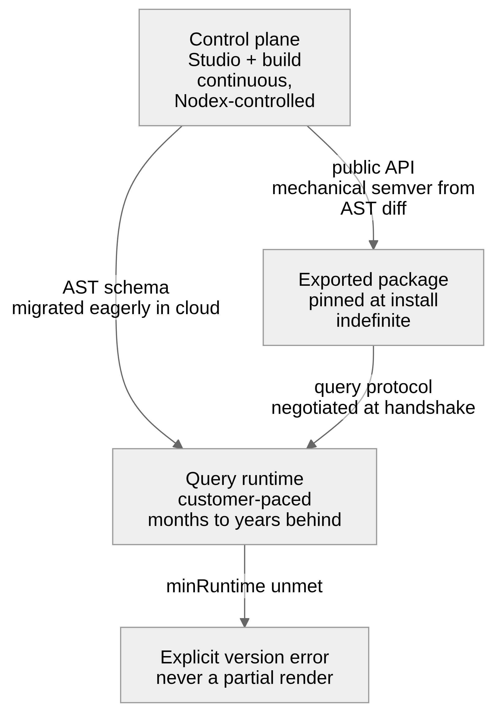

# 07 — Versioning and release

## Four cadences

The platform releases on four independent clocks. Conflating them is the most
expensive mistake available here, because three of the four are outside our
control.

| | Cadence | Controlled by | Version skew |
|---|---|---|---|
| **Control plane** (Studio, build) | Continuous | Nodex | None — one version live |
| **Query runtime** (customer's environment) | Customer-paced, or Nodex-paced when managed | Customer, or Nodex | Months to years self-operated; small when managed |
| **Exported artifacts** (npm, CDN) | Pinned at install | Consuming developer | Indefinite |
| **Binding sets** (the estate) | Continuous, as sites onboard | Customer | None — current set is the only set |

A realistic steady state: Studio is on this week's build, a self-operated runtime
is eleven months old, a team inside that customer has a dashboard package pinned
from before the runtime was last upgraded, and three sites were onboarded to the
estate this morning. All four must interoperate, and none of the last three can be
forced.

Managed runtimes compress the middle row — Nodex upgrades them within an agreed
window, so those customers stay close to current
([Data plane](06-data-plane.md#where-it-runs-and-who-operates-it)). The long tail
is a property of self-operation, not of the architecture. The compatibility rules
below still have to assume it, because self-operation remains supported.

Three consequences follow:

- **The AST schema and the query protocol are long-lived public contracts**, not
  internal formats. They are versioned explicitly and negotiated at runtime.
- **The exported package's public API is a contract with a human** — the
  consuming developer, whose code we cannot see and cannot regenerate.
- **Onboarding a site must not be a release.** Bindings move on their own clock
  precisely so that the estate can grow without touching any of the other three
  (**I12**) — see [Binding sets](#binding-sets).



## Mechanical semver

Because the public API is a deterministic function of the AST (**I4**) and node
ids are stable (**I5**), the version bump is computed, not judged:

```
AST(n-1) ──┐
           ├──▶ shell diff ──▶ API diff ──▶ semver bump ──▶ release gate
AST(n)   ──┘
```

| AST change | API effect | Bump |
|---|---|---|
| Widget added | New handle, new event source | minor |
| Param added (optional) | New optional prop | minor |
| Repeater added | New collection handle | minor |
| Widget made optional | Handle becomes possibly-absent | **major** |
| Widget title changed | None — ids are stable | patch |
| Layout reordered | None | patch |
| Interior regenerated | None | patch |
| Repeat key changed | Instance ids change under consumers | **major** |
| Link target's mapped param removed | The *linking* dashboard's contract breaks | **major** |
| Param renamed or re-typed | Prop renamed / re-typed | **major** |
| Widget deleted | Handle removed | **major** |
| Exposed `::part()` removed | Consumer CSS breaks | **major** |

Three of those rows are consequences of this architecture's later additions and
are easy to get wrong:

**Making a widget optional is breaking, not additive.** It turns a handle a
consumer dereferences today into one that may be absent, which is a type change in
their code even though nothing was removed from the dashboard.

**Changing a repeat key is breaking**, because instance identity is derived from it
(**I11**). Every instance id a consumer has stored, logged, or deep-linked stops
resolving. This is the one breaking change that leaves the dashboard looking
completely normal.

**Links make dependencies bidirectional.** Dashboard B removing a param that
dashboard A maps into it breaks A, not B. The semver gate must therefore diff
*inbound* link references too, and tell the author of B which dashboards link to
it — otherwise the one person who can see the break is the one person not making
the change. How those references resolve — by id plus a version range, or pinned —
is **O13 (OPEN)**.

Enforced in CI by diffing the generated `.d.ts` between builds (api-extractor or
equivalent). A major bump requires explicit acknowledgement from the authoring
developer, in Studio, at the moment they make the change — with a plain statement
of what breaks:

> Renaming this parameter is a breaking change for 3 applications importing
> `@nodex/dashboard-sales`. They will need a code change to upgrade.

That message is the entire point of the machinery. Without it, an authoring
developer has no way to know that a rename in a visual tool is an API break in
someone else's build.

## Binding sets

An estate's bindings are data in the data plane
([06-data-plane.md](06-data-plane.md#binding-resolution)), and they are versioned
apart from everything else. Three rules:

- **Adding, changing or removing a binding is never a dashboard release.** No
  build, no semver bump, no notification to consuming developers. A customer
  onboarding thirty sites this quarter produces zero package versions.
- **The model interface is the contract, and changing it is breaking.** Every
  binding implements a declared shape; adding a required field to that shape
  invalidates every binding that does not yet provide it. So interface changes are
  additive-optional by default, and a required addition is a migration across the
  estate with a deadline, not a schema tweak.
- **A binding is validated when it is registered**, against the interface the
  current definition declares. A definition that adds a widget referencing a field
  some bindings lack must declare that widget `optional`, or it fails validation
  for those sites at build time rather than at render time.

The failure this separation prevents is specific and expensive: a hundred-site
estate where every onboarding emits a version bump, every consuming team sees
weekly minor releases that change nothing for them, and the semver signal becomes
noise inside a month. Once that happens, nobody reads the major-bump warning that
the whole of [Mechanical semver](#mechanical-semver) exists to deliver.

## Compatibility contracts

### AST schema

Additive changes are minor. Removal or re-typing is major and ships with a
forward-only migration, applied eagerly in the control plane
([02-ast.md](02-ast.md#schema-versioning)). Runtimes never migrate ASTs at read
time.

Each built artifact declares `minRuntime`. A runtime too old to execute a
manifest refuses it with an explicit version error — never a partial render, and
never a silently wrong number, which is the worst possible failure in an
analytics product.

### Query protocol

Negotiated at handshake; the runtime advertises capabilities and the client
degrades predictably. Additive within a major version
([06-data-plane.md](06-data-plane.md#query-protocol)).

### Public surfaces, enumerated

Everything here is under the compatibility policy. Everything not here is
internal and may change on any build:

- Custom element tag names
- Properties, attributes, and their types
- Custom events and payload shapes
- Named slots
- CSS custom properties (theme tokens)
- Exposed `::part()` names
- The `mount()` options object, including `binding`
- The iframe `postMessage` protocol
- The query protocol, including the annotation write verb
- The AST schema
- A dashboard's declared params, as seen by *another* dashboard linking to it
- The model interface a binding set implements

The list should stay short. Every entry is something we cannot change for the
length of the support window.

## Support windows

Published, not implied:

- **Query runtime** — security fixes backported for N months; feature
  compatibility with control plane for M months. Both stated publicly; customers
  plan upgrades around them.
- **Query protocol major versions** — supported for at least one full runtime
  support window past deprecation, because a pinned artifact outlives the runtime
  it was built against.
- **Exported packages** — the customer owns the upgrade decision entirely. We
  guarantee that a package built against protocol vN keeps working against any
  runtime advertising vN.
- **CDN URLs** — immutable and permanent. Published bytes are never changed or
  removed. Withdrawing a version breaks production pages we cannot see.
- **Runtime state** — monitor state and the annotation store are migrated
  forward-only on upgrade, and a runtime that cannot migrate refuses to start
  ([06-data-plane.md](06-data-plane.md#state-deployment-and-upgrade)). Annotations
  are customer content: no upgrade may discard them, and the support window for
  reading an old store format is the same as the runtime's.

Deprecations are announced with a date, surfaced in Studio for the authoring
developer and in the runtime's health output for the operator. Nothing is removed
without both having been told.

## Release flow

```
AST change in Studio
  └─ build (reproducible, cached by AST hash)
  └─ API diff vs. previous release
  └─ semver computed
        ├─ patch/minor ──▶ publish
        └─ major ──────▶ explicit acknowledgement required
  └─ publish
        ├─ npm (private registry, scoped)
        ├─ CDN (immutable, versioned, SRI)
        ├─ standalone bundle
        └─ query manifest ──▶ customer's runtime
  └─ audit record: who changed what, what it broke, who acknowledged it
```

Manifest and frontend are published together and version-matched. A frontend must
never run against a manifest from a different dashboard version — the failure
mode is a chart that renders successfully with the wrong numbers, which nobody
catches.
