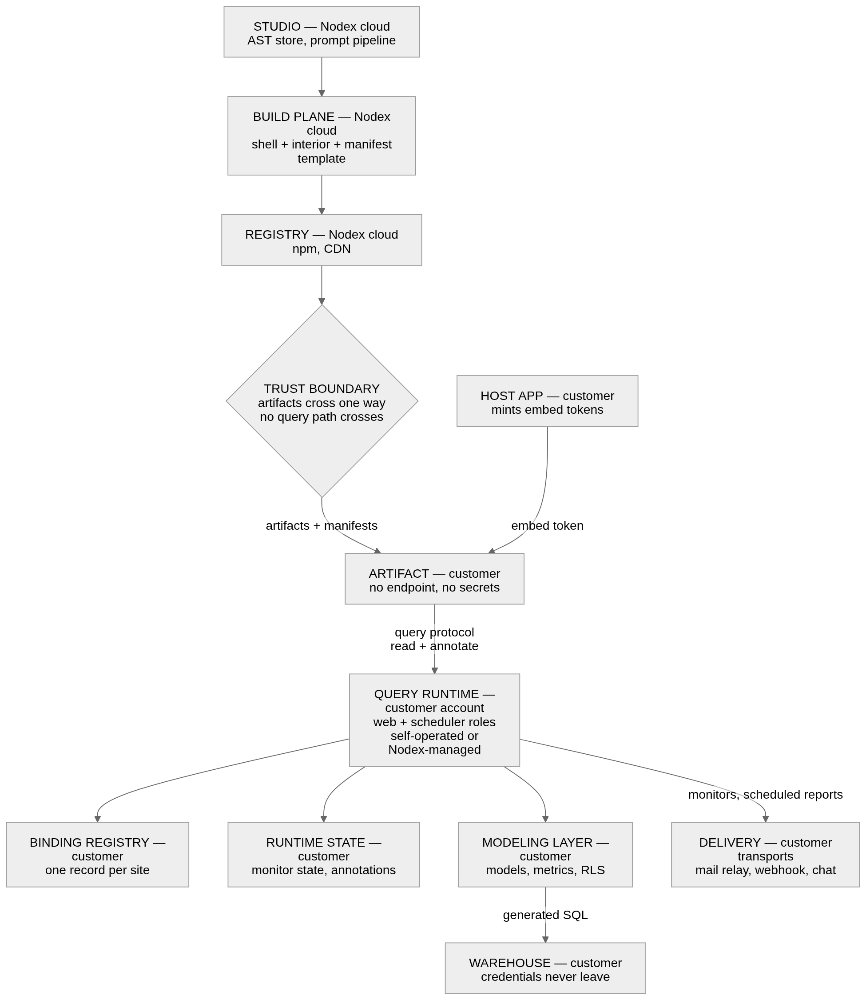

# 08 — Security

## Trust boundaries

```
┌─ Nodex cloud (multi-tenant) ──────────────────┐
│  Studio · AST store · prompt pipeline        │
│  build plane · package registry              │
│  holds: ASTs, prompts, generated artifacts   │
│  never holds: warehouse credentials, query   │
│               results, end-user PII          │
└───────────────────┬──────────────────────────┘
                    │  artifacts + manifests only
                    │  (no runtime data path)
┌───────────────────▼── customer network / account ─┐
│  (runtime operated by the customer, or by Nodex   │
│   through a scoped role — it runs here either way)│
│                                                   │
│  host application ─── mints embed tokens          │
│         │                                         │
│  dashboard artifact ──▶ query runtime ──┬──▶ binding registry
│                             │           ├──▶ monitor state
│                        modeling layer   └──▶ annotation store
│                             │                     │
│                          warehouse                │
│  holds: credentials, data, results, bindings,     │
│         annotations, monitor state                │
└───────────────────────────────────────────────────┘
```

The boundary is crossed only by build artifacts moving in one direction. **No
query ever crosses it.**



## No public query API

Frontends query a runtime in the customer's own environment, never Nodex cloud.
This is a deliberate product decision and it removes an entire class of exposure
that would otherwise be the largest surface in the system. It survives the
managed-hosting option intact, because managed means Nodex operates the runtime
in the customer's account — not that queries come to us.

Had exported dashboards been able to query Nodex cloud, we would need a public,
internet-facing, multi-tenant query API: embed-token validation for every
customer, per-tenant CORS origin allowlists, per-tenant rate limiting and query
cost caps, and cross-tenant isolation on a path reachable from any browser on the
internet. Every one of those is a place to get multi-tenant isolation wrong.

None of it exists, because the data path never leaves the customer's network.

The trade-off is honest and should be stated to customers: **every export format
requires a query runtime in the customer's own environment.** A customer who wants
a single widget in an internal app still needs one. The managed plan removes the
burden of operating it, not the requirement for it — there is no path where a
dashboard queries Nodex cloud. That is a real commercial constraint, and it is
the price of the property above.

## Credentials

**Warehouse credentials never leave the customer's environment (I8).** They are
held by the query runtime and the modeling layer, in the customer's own secret
store. The control plane has no field for them, no code path that accepts them,
and no ability to proxy a query. This holds on a Nodex-managed plan too: the
runtime still runs in the customer's account, and the role Nodex holds there can
deploy and restart the service but cannot read the warehouse or retrieve the
credential values
([Data plane](06-data-plane.md#where-it-runs-and-who-operates-it)).

The runtime also holds state now — the binding registry, monitor firing state, and
the annotation store ([06-data-plane.md](06-data-plane.md#state-deployment-and-upgrade)).
All of it sits inside the customer's account, on the customer's side of the
boundary, and none of it is replicated to the control plane. The consequence for
this document is that **a managed plan puts Nodex operationally adjacent to
customer content at rest**, not merely to results in flight — see
[Operational access on managed plans](#operational-access-on-managed-plans).

Studio's preview needs data, and gets it the same way everything else does:
through the customer's own runtime, over a customer-configured development
connection, with the authoring developer's own identity and row-level security
applied. The preview is not a privileged path.

**Artifacts contain no secrets (I7).** A published CDN bundle or npm package is
inert: no endpoint, no token, no connection string. This is worth restating here
because artifacts are the things most likely to end up somewhere unintended — a
public registry, a customer's public CDN, a decompiled bundle.

## Embed tokens

```
end user ──▶ customer's host app
                  │ authenticates the user (their IdP, their session)
                  │ mints a signed token, server-side:
                  │   { sub, dashboardId, rlsContext, exp, aud }
                  ▼
            dashboard artifact ──▶ query runtime
                                      validates signature, expiry, audience
                                      applies rlsContext via modeling layer
```

Rules:

- Minted **server-side only**. A token mintable in the browser is not a token.
- Short-lived, with refresh through `getToken()`.
- Scoped to one user and one dashboard, and — where the dashboard is bound across
  an estate — to the bindings that user may use.
- Signed with a key the customer controls; the runtime validates against it.
- `rlsContext` is applied by the modeling layer as a non-bypassable predicate.
  The client cannot read, alter, or drop it.

### Bindings are named by the client and authorized by the runtime

One artifact serves the whole estate (**I12**), so the binding arrives as a
`mount()` option — which means it arrives from code running in a browser, and must
be treated as an untrusted claim.

The runtime authorizes it against the token on every request. Naming `plant-12`
when the token permits only `plant-47` is refused, not served. It also
distinguishes two permissions that look like one: **using** a binding, and
**seeing that it exists**. An estate roster is business information, and a site
manager entitled to one plant should not be able to enumerate the other 129
([06-data-plane.md](06-data-plane.md#binding-resolution)).

This is the one place where the "compromising the frontend yields nothing" property
below could have been lost quietly. A binding resolved from a client-supplied
string without authorization would make cross-site data access a one-character
edit in someone's host application.

## What a compromised client can do

Worth stating explicitly, because it is the payoff of the manifest design
([06-data-plane.md](06-data-plane.md)):

A client can only request queries that its manifest already declares, with
parameter values the runtime validates against declared types and the token's
RLS context. It cannot compose a new query, reference a model it was not given,
remove a filter, or widen its own scope.

It also cannot name a binding its token does not permit, and cannot expand a
repeater beyond what the runtime plans and bounds — expansion happens in the
runtime, not the client (**I11**).

So compromising the frontend — an XSS in the host page, a tampered bundle, a
malicious browser extension — yields **no more data access than that dashboard
already had for that user**. This is not true of any design where the client
sends SQL or where query construction happens browser-side.

**The one write verb does not change this.** A compromised client can create
annotations as the user whose token it holds, which is vandalism rather than
disclosure: authorship comes from the token and not the request body, the store is
append-only so nothing earlier can be destroyed, an annotation is visible only to
those who can already read the cell it attaches to, and there is no verb that
reaches the warehouse, the models, or the manifest (**I14**). The exposure added by
making the system read-write is bounded at "a user can write things that user was
allowed to write".

## Scheduled work has no user

Monitors and scheduled reports run on a timer inside the runtime (**I13**,
[06-data-plane.md](06-data-plane.md#monitors-alerts-and-scheduled-delivery)). The
embed-token model above assumes three things a scheduler does not have: a user, a
host application to mint on their behalf, and a short expiry bounded by a session.

So scheduled work needs a principal of its own, and the choice is a security
decision rather than a detail, because it decides **who can cause which data to be
sent to whom**:

| Candidate | What it means | Risk |
|---|---|---|
| The recipient's RLS | Each recipient's copy is filtered to them | Needs a render per recipient; a ten-recipient report is ten evaluations |
| The author's RLS | One evaluation, sent to everyone on the list | The author can send themselves-level access to anyone they can name — privilege escalation by mailing list |
| A declared service principal | Explicit, auditable RLS context configured by the customer | Another credential to govern, and a standing identity that sees more than any one user |

None is obviously right, and the wrong one is discovered after a report reaches
someone who should not have seen a number. **O11 (OPEN)**, and it blocks
implementation of monitors rather than merely informing it.

Whichever is chosen, three rules hold: the principal's context is applied by the
modeling layer as a non-bypassable predicate like any other; every delivery is
audited with the identity it ran as and the recipients it reached; and delivery
transports are operator configuration, never artifact content (**I7**), so a
dashboard cannot name its own destination.

## Annotations

Annotations are the only write in the system (**I14**) and the only customer
content the platform stores. Four controls, none of which is optional:

- **Visibility follows the number.** An annotation is readable by exactly those who
  can read the cell it annotates, enforced by the same row-level security as the
  query that produced that cell. A separate annotation permission model would
  eventually drift from the data one, and the drift would leak the data: *"restated,
  September included the pilot line"* tells a reader who cannot see plant P-4471
  a great deal about plant P-4471.
- **Authorship comes from the token.** Never from the request body. Executives make
  decisions from these records, and forgeable attribution makes them worthless.
- **Append-only.** Edits and deletions are superseding entries. Nothing a
  compromised client does destroys an earlier annotation.
- **The warehouse stays read-only.** There is no verb that writes a number, ticks a
  workflow, or updates a status column in the customer's system of record.

Retention, legal hold, and moderation are the customer's, over their content in
their store — which is one of the arguments in **O12** for an external database
rather than an embedded one.

## Origin controls

For iframe and web component modes, where our code runs inside a page we do not
control:

- `postMessage` messages are origin-checked against an allowlist configured per
  deployment; unrecognised origins are dropped silently.
- The runtime applies a CORS allowlist per deployment. It is customer-configured,
  because only the customer knows their internal hostnames.
- Framing controls (`X-Frame-Options` / CSP `frame-ancestors`) are set by the
  customer for their standalone and iframe deployments; we document the required
  configuration rather than guessing it.

## Operational access on managed plans

When Nodex operates a runtime in a customer's account, operational access is a
trust surface even though no data custody changes hands. The controls are stated
in [Data plane](06-data-plane.md#what-nodex-managed-means-concretely): a
least-privilege role scoped to deploying and running the service, credentials
held by reference rather than value, every action landing in the customer's own
audit log, and revocation available to the customer at any time without stopping
the runtime.

The principle is that we operate the service without reading what passes through
it. **O8 (OPEN)** covers the one place that principle bends — whether an operator
may read query results or result-bearing logs while debugging an incident.

Runtime state widens O8 rather than adding a second open question, and makes it
more pointed. The annotation store holds customer-authored prose at rest, which is
business-sensitive in a way an individual result row is not: an executive writing
*"finance is restating this"* on a quarterly number is commentary a competitor —
or an auditor — would find far more interesting than the number itself. The role
Nodex holds must therefore be scoped to operating the service and not to reading
its storage, and O8 has to be resolved for data at rest and not only for results
in flight.

## Tenant isolation in the control plane

The control plane is multi-tenant and holds authored IP — ASTs, prompts,
generated artifacts — even though it holds no customer data.

- Tenant scoping enforced at the data access layer, not in request handlers.
- Prompt context is assembled from one tenant's models only. A prompt must never
  be able to surface another tenant's model names, metric definitions, or
  dashboard structure through the LLM context window.
- Package registry namespaces are per-tenant and private by default.
- Build isolation: one tenant's build cannot read another's AST or artifacts.
- Full audit log — who authored, who built, who published, who acknowledged a
  breaking change ([07-versioning.md](07-versioning.md)).

**O5 (OPEN)** — storing ASTs in the customer's own git rather than the control
plane reduces this surface considerably, and fits customers who chose on-premise
specifically to keep authored IP in-house. See [02-ast.md](02-ast.md#storage).

## Supply chain

Artifacts are executable code running inside customers' applications, which makes
the build plane a high-value target.

- Reproducible builds — the same AST and toolchain produce identical output, so a
  tampered artifact is detectable by rebuild.
- SRI hashes published for every CDN release.
- Signed packages; published provenance attestation.
- Immutable published versions. Bytes at a published URL never change.
- Dependency pinning and review for anything entering the generated bundle. The
  reactive runtime and the chart and map libraries (**O1**, **O2**) will be loaded
  into every customer's application, and should be chosen with that in mind.
- **Basemap tiles are third-party egress from the end user's browser**, and the one
  runtime network call in the system that does not go to the customer's own runtime
  ([ADR-0011](adr/0011-geo-widget-kinds.md)). The tile source is operator
  configuration and must be self-hostable — both because an airgapped customer has
  no egress at all, and because a default that silently sends viewport coordinates
  to a commercial provider is a disclosure nobody chose.
